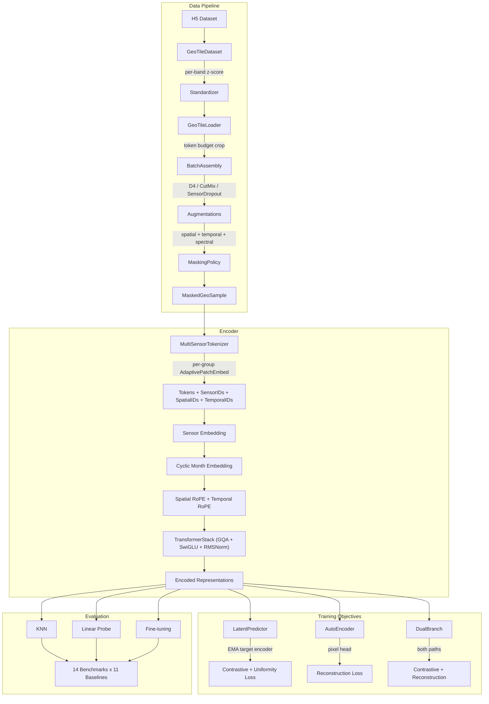
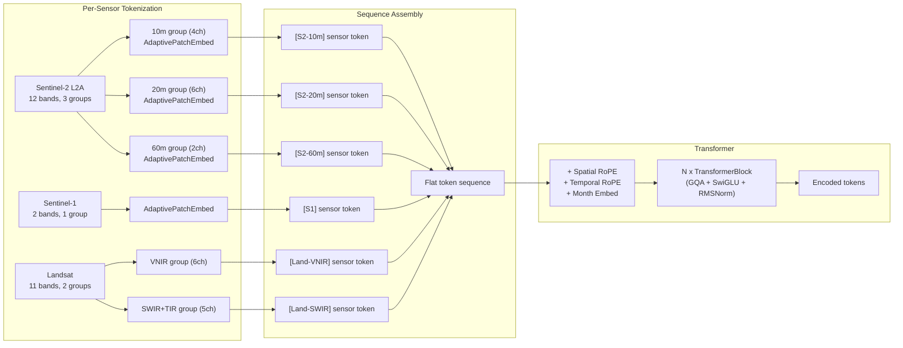
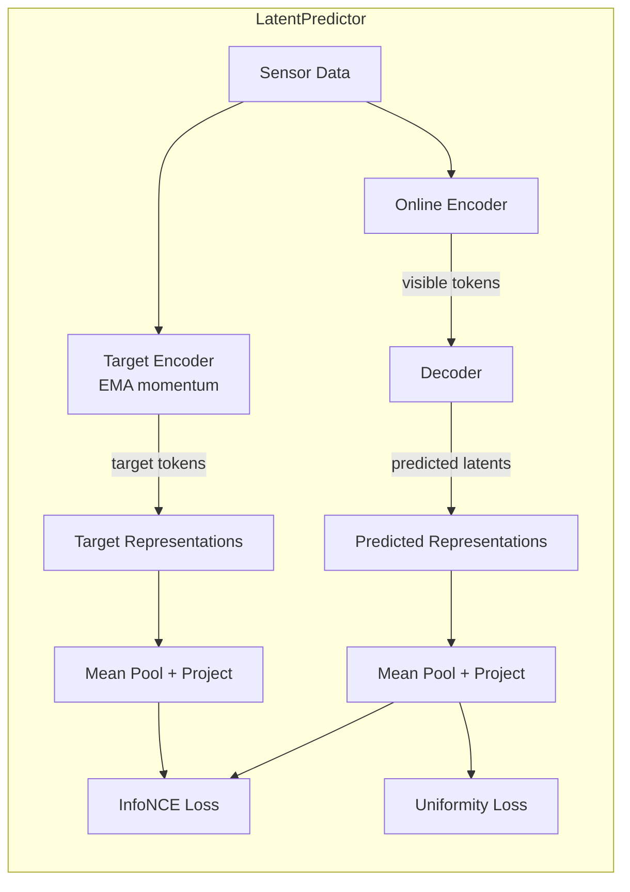
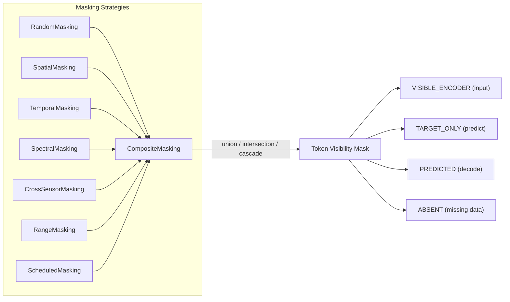
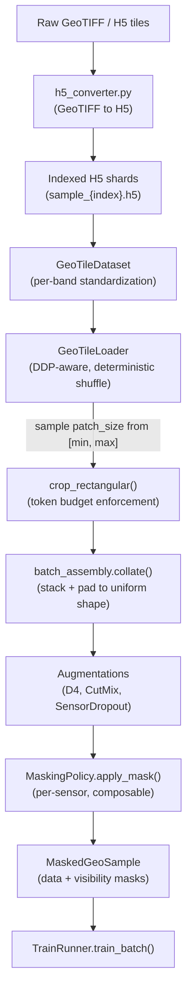
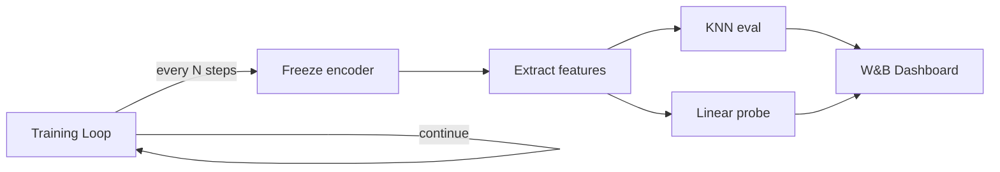

# SpaceNit

**A multi-sensor geospatial foundation model for satellite imagery.**

SpaceNit is a research toolkit for pretraining, evaluating, and adapting foundation models on heterogeneous remote-sensing data. It brings modern transformer design principles -- RMSNorm, SwiGLU, Grouped-Query Attention, Rotary Position Embeddings -- to the geospatial domain, with native support for mixed spatial resolutions, temporal sequences, and 18 satellite sensor types.

---

## 1. Overview

Geospatial foundation models face challenges that text and natural-image models do not: satellite sensors differ in spatial resolution (1 m to 1 km), spectral coverage (2 to 64 bands), temporal cadence (daily to annual), and data availability (cloud cover, sensor gaps). SpaceNit addresses these through three core ideas:

1. **Per-spectral-group tokenization** -- multi-resolution bands are tokenized separately at their native resolution, preserving information that would be lost by upsampling to a common grid.
2. **GSD-aware positional encoding** -- Rotary Position Embeddings are scaled by ground-sample distance, so the model's spatial attention adapts to the sensor's resolution.
3. **Composable masking** -- masking strategies operate independently along spatial, temporal, and spectral axes and can be combined via union, intersection, or cascade.

---

## 2. Architecture

### 2.1 System Overview



### 2.2 Encoder Detail

The encoder processes a variable-length sequence of tokens from multiple sensors and timesteps. The key stages are:



**Patch embedding.** Each spectral group uses `nn.Unfold` + `nn.Linear` (FlexiViT-style), allowing the patch size to change at runtime. Training samples different patch sizes per batch; at inference, any patch size can be used without retraining.

**Positional encoding.** Three signals are combined:
- **Spatial RoPE**: 2D rotary frequencies scaled by `gsd / reference_gsd`, so a 10 m Sentinel-2 patch and a 30 m Landsat patch at the same geographic location produce compatible encodings.
- **Temporal RoPE**: 1D rotary frequencies over the timestep axis.
- **Cyclic month embedding**: A learned projection of `(sin(2pi * month/12), cos(2pi * month/12))`, applied per-timestep to each token.

### 2.3 Transformer Block

Each block in the `TransformerStack` uses post-norm residual connections:

```
x = x + GQA(RMSNorm(x), rope_freqs)
x = x + SwiGLU_FFN(RMSNorm(x))
```

| Component | Detail |
|---|---|
| Attention | Grouped-Query Attention (configurable KV heads) with `F.scaled_dot_product_attention` |
| FFN | SwiGLU: `Linear(D, 8D/3) * SiLU(Linear(D, 8D/3))` then `Linear(8D/3, D)` |
| Norm | RMSNorm (no learnable bias, faster than LayerNorm) |
| Dropout | Applied to attention weights and FFN output |

### 2.4 Training Objectives



| Objective | Loss | Description |
|---|---|---|
| **Contrastive latent** | InfoNCE + Uniformity | Learnable temperature, L2-normalized projections, Gaussian potential uniformity regularizer |
| **Latent prediction** | Smooth L1 (Huber) | Predict target encoder's latent representations for masked tokens |
| **Reconstruction** | MSE / L1 / Smooth L1 | Pixel-level reconstruction of masked patches via `PixelHead` (`nn.Linear` + `nn.Fold`) |
| **Dual-branch** | Contrastive + Reconstruction | Joint training with shared encoder, separate decoders |

The EMA target encoder uses a momentum schedule that warms up from `ema_momentum` to `ema_momentum_end` over `ema_warmup_steps`. The step counter is persisted as a `register_buffer` for correct checkpoint resume.

### 2.5 Masking System



Masking operates per-sensor, respecting each sensor's spatial grid and spectral group count. Absent tokens (sentinel value `-99999`) are automatically detected at the patch level and excluded from both encoding and prediction targets.

---

## 3. Data Pipeline

### 3.1 Supported Sensors

| Sensor | Bands | Spectral Groups | Spatial | Temporal |
|--------|-------|-----------------|---------|----------|
| Sentinel-2 L2A | 12 | 3 (10m / 20m / 60m) | Yes | Yes |
| Sentinel-1 | 2 | 1 | Yes | Yes |
| Landsat | 11 | 2 (VNIR / SWIR+TIR) | Yes | Yes |
| NAIP | 4 | 1 | Yes | No |
| ERA5 | 6 | 1 | No | Yes |
| WorldCover | 1 | 1 | Yes | No |
| SRTM | 1 | 1 | Yes | No |
| OpenStreetMap | 30 | 1 | Yes | No |
| CDL | 1 | 1 | Yes | No |
| WorldCereal | 8 | 1 | Yes | No |
| WorldPop | 1 | 1 | Yes | No |
| WRI Canopy Height | 1 | 1 | Yes | No |
| GSE | 64 | 1 | Yes | No |
| + 5 more variants | | | | |

New sensors are added by registering a `SensorSpec` in `SensorRegistry` -- no code changes needed elsewhere.

### 3.2 Data Flow



**Token budget.** Each sample is cropped so that its total token count (across all sensors, timesteps, and spectral groups) does not exceed `token_budget` (default 2250). The crop is rectangular in spatial dimensions and preserves the full temporal extent.

**Multi-scale training.** Patch sizes are sampled per batch from `[min_patch_size, max_patch_size]` (default [1, 8]). This trains the FlexiViT-style patch embedding to generalize across resolutions.

### 3.3 Augmentations

| Augmentation | What it does | Why |
|---|---|---|
| **RandomDihedralTransform** | Applies one of 8 D4 symmetries (rotations + flips) to spatial dims | Satellite imagery has no canonical orientation |
| **CutMix** | Pastes a rectangular region from a shifted batch sample | Regularization, forces local feature learning |
| **SensorDropout** | Randomly zeroes entire sensors with configurable probability | Multi-modal robustness, prevents sensor co-adaptation |

---

## 4. Evaluation Framework

### 4.1 Methods

| Method | Description |
|---|---|
| **KNN** | k-nearest neighbors on frozen encoder features |
| **Linear probe** | Train a linear classifier on frozen features (configurable LR, epochs) |
| **Fine-tuning** | End-to-end training with task-specific head |
| **Bootstrap CI** | Confidence intervals via bootstrap resampling |

### 4.2 Benchmark Datasets (14)

Scene classification (EuroSAT, BigEarthNet, So2Sat), semantic segmentation (MADOS, PASTIS), change detection, crop type mapping (CDL, crop parcels, crop timeseries), marine debris detection, flood scene classification, and more via GeoBench and rslearn adapters.

### 4.3 Baseline Model Adapters (11)

All evaluable through a unified interface for fair comparison:

Panopticon, DINOv3, Galileo, Satlas, CROMA, AnySat, Clay, Presto, PrithviV2, Tessera.

### 4.4 In-Loop Evaluation

Downstream tasks run at configurable step intervals during pretraining. Results are logged to W&B alongside training metrics.



---

## 5. Model Configurations

| Size | Encoder dim | Depth | Heads | Decoder depth | Approx. params |
|------|-------------|-------|-------|---------------|----------------|
| **Nano** | 128 | 4 | 8 | 4 | ~2-3M |
| **Tiny** | 192 | 12 | 3 | 12 | ~10M |
| **Base** | 768 | 12 | 12 | 4 | ~85M |
| **Large** | 1024 | 24 | 16 | 4 | ~300M |

All sizes use FFN expansion ratio 4x, SwiGLU activation, and cosine learning rate schedule with warmup.

---

## 6. Getting Started

### Installation

Python 3.12 recommended. We use [uv](https://docs.astral.sh/uv/getting-started/installation/) for dependency management.

```bash
git clone https://github.com/VihariKanukollu/spacenit.git
cd spacenit
uv sync --locked --all-groups --python 3.12
```

For inference-only (no training extras):

```bash
uv sync --locked
```

Quick check:

```bash
uv run python -c "import spacenit; print('spacenit loaded')"
```

### Training (Nano LatentMIM, 8x H100, DDP) — what we run in production

```bash
cd /workspace/Spatial/spacenit

# HDF5 compression plugins
export HDF5_PLUGIN_PATH="$(
  /workspace/Spatial/spacenit/.venv/bin/python -c "import hdf5plugin; print(hdf5plugin.PLUGINS_PATH)"
)"

# W&B API key (pulled from /root/.netrc; alternative is `wandb login`)
export WANDB_API_KEY="$(
  /workspace/Spatial/spacenit/.venv/bin/python - <<'PY'
import netrc
n = netrc.netrc('/root/.netrc')
a = n.authenticators('api.wandb.ai')
if not a or not a[2]:
    raise SystemExit('No wandb key in /root/.netrc')
print(a[2])
PY
)"

# Optional: GeoBench for downstream eval
export GEOBENCH_DIR="/workspace/datasets/geobench"

# Fresh start (optional)
rm -rf local_output/checkpoints/anonymous/nano_latentmim_30ep_eval2000

/workspace/Spatial/spacenit/.venv/bin/torchrun --standalone --nproc_per_node=8 scripts/official/nano.py \
  train nano_latentmim_30ep_eval2000 local \
  --dataset.h5py_dir=/workspace/Spatial/spacenit/local_olmoearth_indexed/h5py_data/cdl_gse_landsat_openstreetmap_raster_sentinel1_sentinel2_l2a_srtm_worldcereal_worldcover_worldpop_wri_canopy_height_map/220094 \
  --train_module.dp_config.name=ddp \
  --data_loader.global_batch_size=512 \
  --train_module.rank_microbatch_size=32 \
  --data_loader.num_workers=4 \
  --trainer.callbacks.wandb.enabled=True \
  --trainer.callbacks.wandb.entity=viharikvs-urbankisaan \
  --trainer.callbacks.wandb.project=spacenit \
  --trainer.callbacks.wandb.upload_dataset_distribution_pre_train=False \
  --trainer.callbacks.wandb.upload_modality_data_band_distribution_pre_train=False \
  --trainer.callbacks.downstream_evaluator.enabled=True \
  --trainer.callbacks.downstream_evaluator.tasks_to_run='["m-eurosat"]' \
  --trainer.callbacks.downstream_evaluator.eval_on_startup=False \
  --trainer.callbacks.downstream_evaluator.run_on_test=False \
  --trainer.callbacks.checkpointer.save_async=False \
  --trainer.callbacks.checkpointer.pre_train_checkpoint=False \
  --trainer.callbacks.checkpointer.save_interval=4290 \
  --trainer.callbacks.checkpointer.ephemeral_save_interval=429 \
  --trainer.max_duration.unit=epochs \
  --trainer.max_duration.value=30
```

Notes:

- **Resume**: omit the `rm -rf ...` line and re-run the same command; it will resume from the latest checkpoint in that run folder.
- **Eval cadence**: `m-eurosat` eval is configured to run every **2000 steps** in `scripts/official/script.py` (see `EVAL_TASKS["m-eurosat"].eval_interval`).

### Running Tests

```bash
# Full test suite (161 tests)
uv run --all-groups --no-group flash-attn pytest tests/

# Minimal-dependency model loading tests
uv run --group dev pytest tests_minimal_deps/
```

---

## 7. Configuration Reference

All hyperparameters are configurable via CLI overrides. The config system supports both [olmo-core](https://github.com/allenai/OLMo-core) `Config` dataclasses and a standalone fallback.

| Parameter | Default | Description |
|---|---|---|
| `data_loader.global_batch_size` | 512 | Total batch size across all GPUs |
| `train_module.rank_microbatch_size` | 32 | Per-GPU microbatch size |
| `data_loader.token_budget` | 2250 | Max tokens per sample |
| `data_loader.min_patch_size` | 1 | Minimum FlexiViT patch size |
| `data_loader.max_patch_size` | 8 | Maximum FlexiViT patch size |
| `train_module.contrastive_temperature` | 0.1 | Initial InfoNCE temperature |
| `train_module.uniformity_weight` | 0.1 | Uniformity loss weight |
| `train_module.max_grad_norm` | 1.0 | Gradient clipping norm |
| `trainer.max_duration` | epochs:300 | Training duration (epochs or steps) |
| `train_module.scheduler.warmup_steps` | 8000 | LR warmup steps |
| `train_module.optim_config.lr` | 0.0001 | Peak learning rate |
| `train_module.optim_config.weight_decay` | 0.02 | AdamW weight decay |

---

## 8. Project Structure

```
spacenit/
  arch/                  # Neural network modules
    attention.py         #   GQA, RMSNorm, SwiGLU, TransformerStack
    embed.py             #   AdaptivePatchEmbed, SpatialRoPE, TemporalRoPE, CyclicMonthEmbed
    encoder.py           #   MultiSensorTokenizer, Encoder, Decoder
    heads.py             #   PixelHead, ProjectionHead, PoolingHead
    models.py            #   LatentPredictor, AutoEncoder, DualBranch, SpatioTemporalEncoder
    band_tokenization.py #   Per-spectral-group tokenization config

  ingestion/             # Data loading and preprocessing
    sensors.py           #   SensorRegistry, SensorSpec (18 sensors)
    tile_dataset.py      #   H5 dataset reader with normalization
    tile_loader.py       #   Distributed data loader with token budget
    batch_assembly.py    #   Collation, masking, augmentation
    augmentations.py     #   D4 dihedral, CutMix, SensorDropout

  pipeline/              # Training infrastructure
    runners/             #   ContrastiveLatent, LatentPrediction, AutoEncoder, DualBranch
    losses.py            #   Contrastive, latent prediction, reconstruction, uniformity
    masking.py           #   8 composable masking strategies + absent token detection
    helpers.py           #   Batch partitioning, memory utilities
    hooks/               #   W&B logger, throughput monitor, downstream eval

  benchmarks/            # Evaluation framework
    adapters/            #   11 external model adapters
    datasets/            #   14 benchmark dataset loaders
    knn_eval.py          #   KNN evaluation
    linear_probe.py      #   Linear probe training
    finetune/            #   Full fine-tuning harness

  conversion/            # Dataset preparation (GeoTIFF to H5)
  ops/                   # Experiment orchestration and CLI
  profiling/             # Throughput benchmarking

scripts/official/        # Training scripts (nano, tiny, base, large)
tests/                   # Unit + integration + e2e smoke tests (161 tests)
```

---

## License

This project is proprietary software. See [LICENSE](LICENSE) for details. Unauthorized copying, modification, distribution, or use is strictly prohibited.
